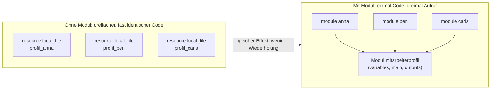

# Module erweitert

[Module und Outputs](../06-module-und-outputs/00-module-und-outputs.md) hat schon ein Modul gebaut - dabei ging es aber gleichzeitig um `templatefile()`, `object`-Typen und generierte HTML-Seiten. Viel auf einmal. Dieses Kapitel geht einen Schritt zurück und erklärt **nur** die Modul-Mechanik selbst, noch einmal in Ruhe und an einem bewusst einfacheren Beispiel: kein HTML, keine Templates, nur Variablen rein, eine Datei raus.

## Das Problem, das Module lösen

Stellt euch vor, ihr wollt für drei Personen im Team je eine kleine Profildatei anlegen:

```hcl
resource "local_file" "profil_anna" {
  filename = "${path.module}/output/anna.txt"
  content  = "Name: Anna\nRolle: Trainerin"
}

resource "local_file" "profil_ben" {
  filename = "${path.module}/output/ben.txt"
  content  = "Name: Ben\nRolle: Entwickler"
}

resource "local_file" "profil_carla" {
  filename = "${path.module}/output/carla.txt"
  content  = "Name: Carla\nRolle: Entwicklerin"
}
```

Live getestet, das funktioniert - aber schaut euch die drei Blöcke an: **strukturell komplett identisch**, nur Name und Rolle unterscheiden sich. Soll sich morgen das Format ändern (z.B. eine Zeile "Abteilung:" dazu), müsst ihr das an drei Stellen anpassen. Bei drei Personen ist das lästig, bei dreißig wird es unhaltbar.

## Die Lösung: ein Modul

Ein Modul ist im Kern nichts anderes als **ein Ordner mit `.tf`-Dateien, der eine feste Eingabe/Ausgabe-Schnittstelle hat** - Variablen rein, Outputs raus. Genau der wiederholende Teil von oben wandert einmal in dieses Modul, der Rest bleibt draußen:

```hcl
# modules/mitarbeiterprofil/variables.tf
variable "name" {
  type = string
}

variable "rolle" {
  type = string
}

variable "output_dir" {
  type = string
}
```

```hcl
# modules/mitarbeiterprofil/main.tf
resource "local_file" "profil" {
  filename = "${var.output_dir}/${var.name}.txt"
  content  = "Name: ${var.name}\nRolle: ${var.rolle}"
}
```

```hcl
# modules/mitarbeiterprofil/outputs.tf
output "pfad" {
  value = local_file.profil.filename
}
```

Und im Root-Modul wird daraus:

```hcl
module "anna" {
  source     = "./modules/mitarbeiterprofil"
  name       = "Anna"
  rolle      = "Trainerin"
  output_dir = "${path.module}/output"
}

module "ben" {
  source     = "./modules/mitarbeiterprofil"
  name       = "Ben"
  rolle      = "Entwickler"
  output_dir = "${path.module}/output"
}

module "carla" {
  source     = "./modules/mitarbeiterprofil"
  name       = "Carla"
  rolle      = "Entwicklerin"
  output_dir = "${path.module}/output"
}
```

Live getestet - dasselbe Ergebnis wie vorher (drei Dateien, gleicher Inhalt), aber die eigentliche Logik (`local_file` mit `filename`/`content`) steht jetzt nur noch **einmal** im Modul. Ändert sich morgen das Format, ändert ihr eine Datei - `main.tf` im Modul - und alle drei Aufrufe ziehen automatisch nach.



## Die drei Teile eines Moduls, einzeln betrachtet

- **`variables.tf`** = die Eingabe-Schnittstelle. Alles, was von außen hineinkommen soll, muss hier als `variable` deklariert sein - nichts anderes kommt von draußen ins Modul hinein. Ein Modul sieht nicht automatisch, was im Root-Modul passiert.
- **`main.tf`** (oder beliebig viele `.tf`-Dateien) = die eigentliche Arbeit. Hier stehen ganz normale `resource`-Blöcke, genau wie überall sonst im Kurs - ein Modul ist kein neues Konzept, sondern derselbe Terraform-Code, nur in einem eigenen Ordner.
- **`outputs.tf`** = die Ausgabe-Schnittstelle. Alles, was der Aufrufer später braucht (hier: der Dateipfad), muss hier als `output` zurückgegeben werden - sonst bleibt es innerhalb des Moduls unsichtbar.

Diese drei Teile sind komplett unabhängig von der Frage, *wie oft* oder *mit welchen Werten* das Modul aufgerufen wird - das entscheidet allein der Aufrufer, hier das Root-Modul mit drei `module`-Blöcken.

## Selbst ausprobieren

In diesem Ordner liegt das komplette, lauffähige Beispiel mit dem `local`-Provider (kein Cloud-Zugang nötig):

```bash
terraform init
terraform apply
terraform state list
cat output/Anna.txt
```

`terraform state list` zeigt drei komplett unabhängige Modul-Instanzen (`module.anna.local_file.profil`, `module.ben.local_file.profil`, `module.carla.local_file.profil`) - jede mit eigenem State-Eintrag, obwohl der Code im Modul nur einmal existiert.

Zum Ausprobieren: eine vierte Person als weiteren `module`-Block ergänzen, oder das Ausgabeformat in `modules/mitarbeiterprofil/main.tf` ändern und beobachten, wie sich die Änderung bei `apply` auf alle drei Instanzen gleichzeitig auswirkt.

Zum selbst Bauen statt Nachvollziehen: [Playground-Aufgabe 7](../../playground/07-eigenes-modul-team/AUFGABE.md).
